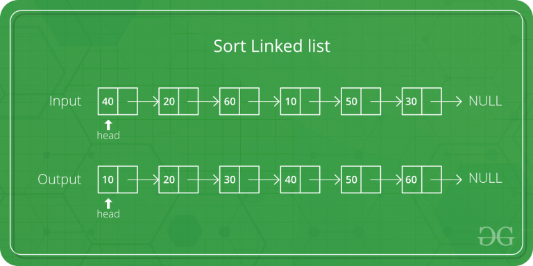

## Best Sorting Algorithms for Linked List
----------
*Merge sort is often preferred for sorting a linked list. The slow random-access performance of a linked list makes some other algorithms (such as quicksort) perform poorly, and others (such as heapsort) completely impossible.*




### Steps Required for Sorting the LinkedList using Merge Sort

```language
MergeSort(headRef)
1) If the head is NULL or there is only one element in the Linked List
    then return.
2) Else divide the linked list into two halves.
      FrontBackSplit(head, &a, &b); /* a and b are two halves */
3) Sort the two halves a and b.
      MergeSort(a);
      MergeSort(b);
4) Merge the sorted a and b (using SortedMerge() discussed here)
   and update the head pointer using headRef.
     *headRef = SortedMerge(a, b);
```

### Descriptions
*Let head be the first node of the linked list to be sorted and headRef be the pointer to head. Note that we need a reference to head in MergeSort() as the below implementation changes next links to sort the linked lists (not data at the nodes), so head node has to be changed if the data at the original head is not the smallest value in the linked list.*

### Reference
[GeeksForGeeks](https://www.geeksforgeeks.org/merge-sort-for-linked-list/#:~:text=Merge%20sort%20is%20often%20preferred,be%20the%20pointer%20to%20head.)


<p align="center">
Thanks Coding !
Thanks for Open Source Contribution!
</p>